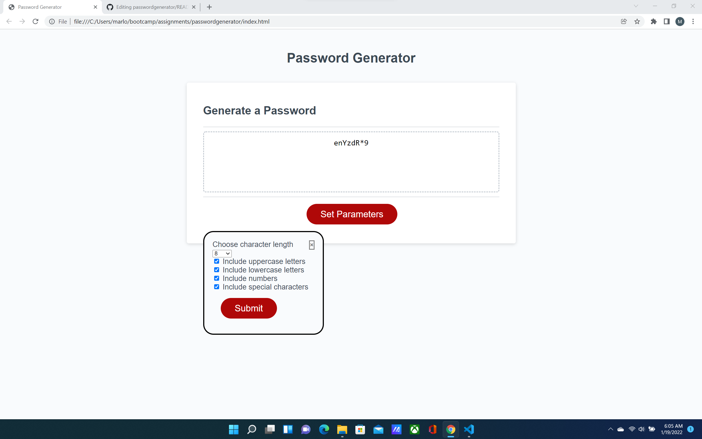

This is a password generator. It functions by having the user set some parameters for a random password and then generating a password in accordance to the users choices.
The acceptance criteria was to utilize alert, prompt and confirm boxes for setting the parameters which were done in the initial working version put onto github, however, it was soon found
that just using those boxes was limiting and made the site the tiniest bit wonky, so the series of boxes that the user was confronted with was consolidated onto a single modal element that
appears when you click the now renamed "set parameters" button.

https://marlowemich.github.io/passwordgenerator/
